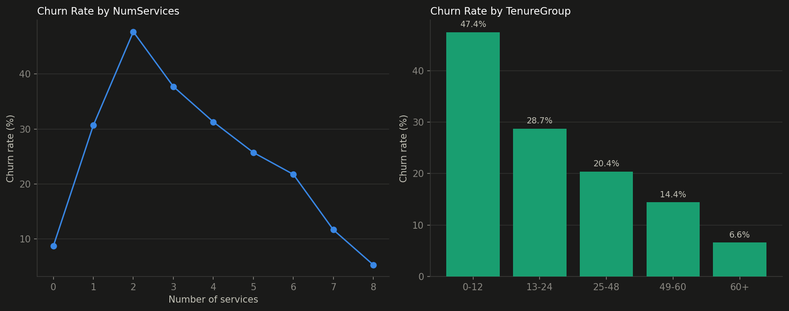
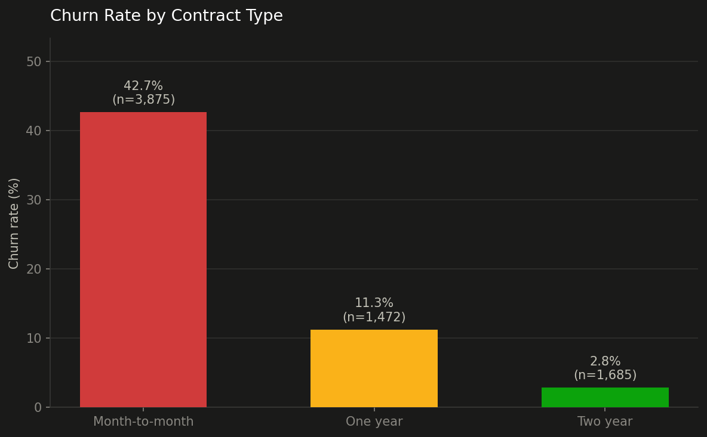
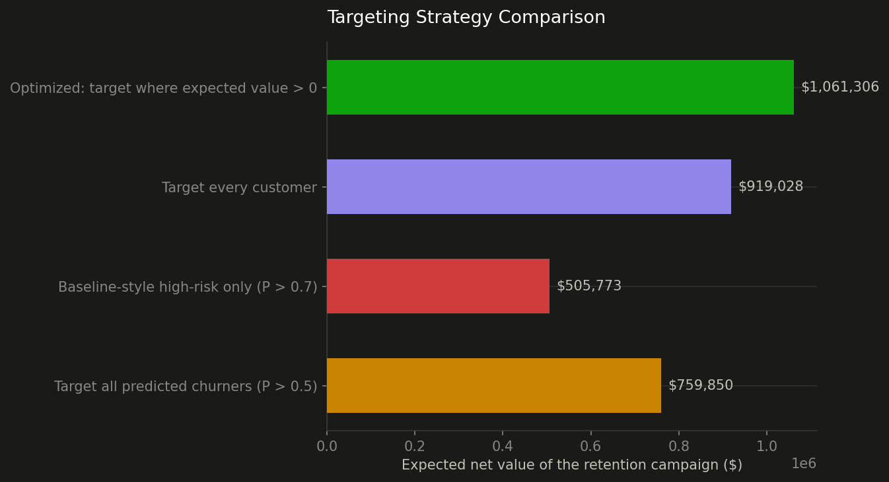

# Telecom Customer Churn: From Prediction to Retention ROI 📉💰

A churn prediction and **retention-ROI decision** pipeline on the IBM Telco Customer Churn
dataset — built to explicitly improve on a public Kaggle baseline, then go a step further
than most churn projects stop: not just *who* will churn, but *who's worth spending a
retention budget on*.

📓 **[Read the full notebook: `telecom_churn_retention.ipynb`](telecom_churn_retention.ipynb)**
🧹 **[Data cleaning & EDA companion notebook: `data_cleaning_eda.ipynb`](data_cleaning_eda.ipynb)**

## Data prep & EDA

Before any modeling, a companion notebook covers the preprocessing this project actually
runs on: a `TotalCharges` column disguised as text (masking 11 genuinely missing values), a
duplicated missing-value handler bug caught mid-build, chi-square/Welch's t-test feature
selection (statistically confirming `gender` and `PhoneService` carry no churn signal —
dropped), and two engineered features. The more interesting of the two, `NumServices`, isn't
simply "fewer is safer" — churn rate rises sharply from 0 to 2 services (8.7% → 47.7%, the
single riskiest group) before falling steadily as bundling deepens, down to 5.3% at 8
services.



## Starting point

This project began from a published Kaggle notebook ([*Customer Retention & Churn
Insights*](https://www.kaggle.com/code/cairncorreia/customer-retention-and-churn-insights))
reporting 77% accuracy with an XGBoost + SMOTE pipeline. Rather than restart from scratch,
that notebook is used as a baseline to improve on — fixing three concrete, common pitfalls
along the way:

| Issue in the baseline | Fix here |
|---|---|
| A "no internet service" category duplicated across 6 columns → multicollinearity | Collapsed into a single indicator |
| Churn probabilities scored against the same data the model was trained on | Out-of-fold cross-validated scoring — no leakage |
| Two different models used for reporting vs. scoring, with no shared threshold logic | One model, one encoding, one train/test split, throughout |

## Results vs. baseline

| Metric | Baseline (Kaggle) | This notebook |
|---|---|---|
| Accuracy | 77.0% | **79.3%** |
| F1 (churn) | 0.57 | **0.626** |
| Precision (churn) | 0.57 | **0.602** |
| Recall (churn) | 0.57 | **0.652** |
| ROC AUC | 0.814 | **0.840** |

The decision threshold is chosen deliberately — the F1-maximizing threshold *among those
that already match or beat the 77% baseline accuracy* — so the final model isn't winning
on one metric by quietly losing on another.

## The differentiator: retention ROI, not just prediction

Most churn tutorials stop at a risk score. A real retention program has a budget: every
customer contacted with a retention offer costs money, and that spend is only worth it if
the customer is valuable enough and likely enough to respond. This notebook builds an
**expected-value targeting framework** on top of the churn model — and documents a real bug
caught while building it:

Naively reusing the baseline's `CLTV = ARPU / churn probability` formula, then combining it
with `Expected Benefit = P(churn) × offer success rate × CLTV`, causes the churn
probability to **algebraically cancel out** of the targeting decision — the one variable the
whole exercise is supposed to be based on. The fix: estimate CLTV independently of the
customer's own risk score (from contract-type cohort behavior), so churn probability keeps
doing real work in the decision.

The resulting optimized targeting strategy beats naive alternatives ("target everyone
predicted to churn," "target only the highest-risk customers") by real, quantified margins
— see the notebook for the full comparison and a cost/success-rate sensitivity analysis.

### Sample output





## Interactive dashboard

The scored dataset (`customer_churn_scored.json`) feeds a live, interactive dashboard —
filter by contract, risk band, and tenure, and adjust the retention-offer cost/success-rate
assumptions to watch the targeting recommendation and expected campaign value update in
real time.

## Running it

```bash
python3 -m venv venv
source venv/bin/activate
pip install -r requirements.txt
jupyter notebook telecom_churn_retention.ipynb
```

## Honest limitations

- CLTV is still a simplification — a proper implementation would use survival analysis
  (Kaplan-Meier or Cox proportional hazards) rather than a contract-type average proxy.
- Offer cost and success rate are stated assumptions, not measurements — a real program
  would derive them from a pilot campaign (which is why the dashboard makes them
  adjustable rather than fixed).
- This is a static snapshot dataset with no real signup dates — "churn rate over time"
  isn't actually measurable from it; tenure is a proxy for relationship age, not a
  calendar trend.

## Stack

Python · pandas · scikit-learn · XGBoost · Matplotlib · Jupyter

---

Part of a portfolio of applied data science projects — [kaankartalkuyucu.com](https://www.kaankartalkuyucu.com)
